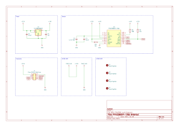

# PMW3360 breakout board - SUMI（墨）

## 特徴

PMW3360用のコンパクトで低コストなブレイクアウトボードです。自作キーボードや自作トラックボールの試作や流用・組み込みを意識して設計されています。

- 3.3Vのみで動作に限定することで部品点数を削減し低コスト・コンパクト化
- 手はんだでの実装を前提とし手はんだ用のパッドサイズと間隔を採用
- 基板の中心とOptical Centerが一致するように配置

## 寸法/Dimensions

20mm x 30mm

## 回路図/Schematic

## 部品表/BOM

| Reference | Value          | Qty  |
| --------- | -------------- | ---- |
| C1, C4    | 0.1uF          | 2    |
| C2        | 1uF            | 1    |
| C3        | 4.7uF/10V      | 1    |
| R1, R3    | 10k            | 2    |
| R2        | 39R            | 1    |
| U1        | TLV70019DDCR   | 1    |
| U2        | PMW3360DM-T2QU | 1    |

## ライセンス/License

This project is licensed under the CERN OHL-P v2.
You may use, distribute, and modify this design under the terms of the CERN OHL-P v2.
Original design by snize.
