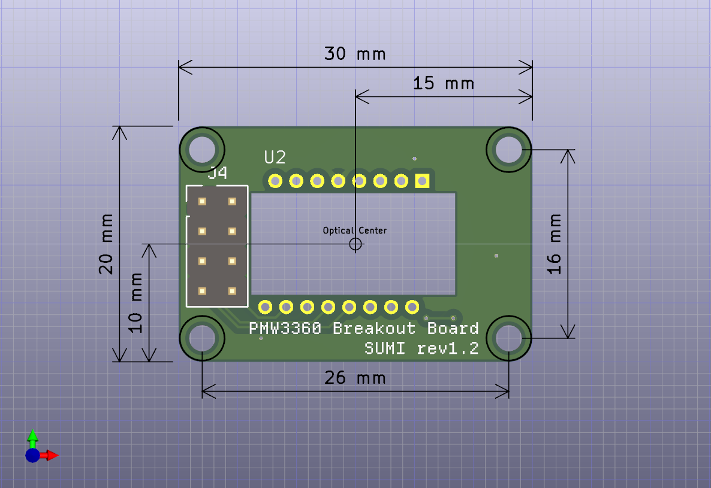

# PMW3360 breakout board - SUMI（墨）

ブレイクアウトボード自体はBoothから購入もできます https://bulblub.booth.pm/items/6164153

## 特徴

PMW3360用のコンパクトで低コストなブレイクアウトボードです。[PMW3610 breakout board \- SEIBOKU（青墨）](https://github.com/snize/BOB-PMW3610-SEIBOKU)と同様の設計思想で設計され、自作キーボードや自作トラックボールの試作や流用・組み込みを意識しています。

- 3.3Vのみで動作に限定することで部品点数を削減し低コスト・コンパクト化
- 手はんだでの実装を前提とし手はんだ用のパッドサイズと間隔を採用
- 平面的には基板の中心とOptical Centerが一致するように配置
- 立体的にはレンズ部の厚みは約3.4mm(PMW3610は約4.0mm)で若干の違いあり

## 寸法図/Dimensions

## 回路図/Schematic

## KiCanvasで見る

https://kicanvas.org/?github=https://github.com/snize/BOB-PMW3360-SUMI

## 部品表/BOM

| Reference | Value          | Qty  |
| --------- | -------------- | ---- |
| C1, C4    | 0.1uF          | 2    |
| C2        | 1uF            | 1    |
| C3        | 4.7uF/10V      | 1    |
| R1, R3    | 10k            | 2    |
| R2        | 39R            | 1    |
| U1        | TLV70019DDCR   | 1    |
| U2        | PMW3360DM-T2QU | 1    |

## 使用フォント/Font

本プロジェクトでは、**Departure Mono** フォントを使用しています。[rektdeckard/departure-mono](https://github.com/rektdeckard/departure-mono)

## ライセンス/License

This project is licensed under the CERN OHL-P v2.
You may use, distribute, and modify this design under the terms of the CERN OHL-P v2.
Original design by snize.

### 本プロジェクトを利用する場合について

- 著作権表示とライセンスの表示を残してください
- issueなどで利用した旨を報告していただけると作者が喜びます
  - 作例にバックリンクさせていただきます

## 本プロジェクトを利用した作例

- 
